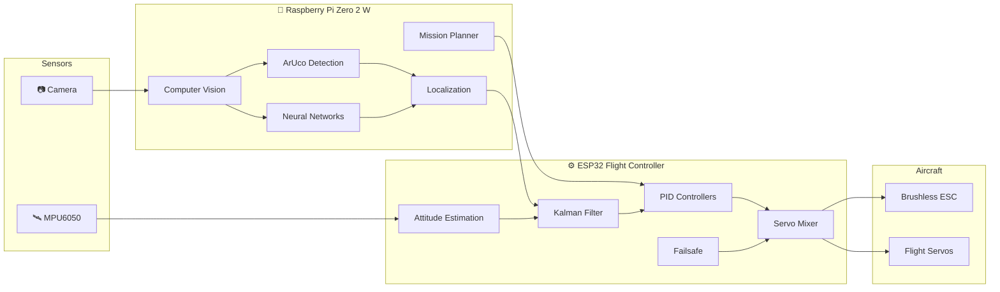
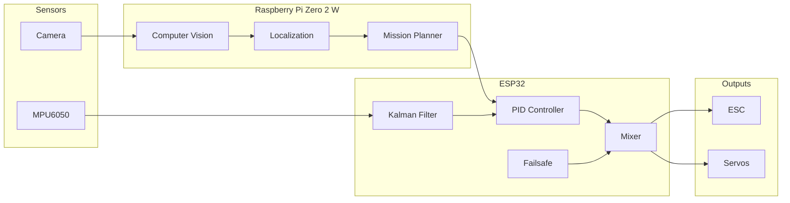
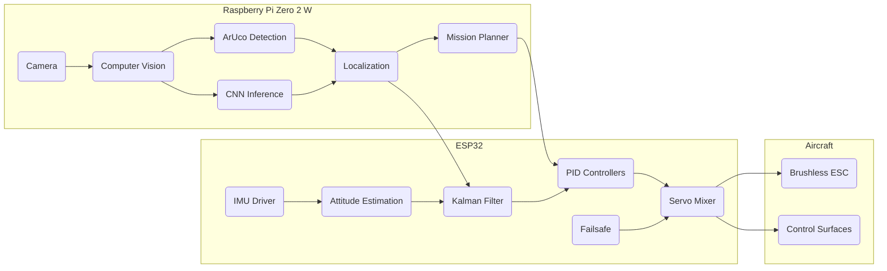

<div align="center">

# 🍋 Ardu-Citron

### *An autonomous fixed-wing aircraft built from scratch.*

**A personal robotics project exploring autonomous flight, embedded systems, computer vision and artificial intelligence.**

---


*A project born from curiosity, built for learning.*

</div>

---

# Table of Contents

- [About](#about)
- [Why Ardu-Citron?](#why-ardu-citron)
- [Project Philosophy](#project-philosophy)
- [Project Goals](#project-goals)
- [Current Features](#current-features)
- [Architecture Overview](#architecture-overview)
- [Design Principles](#design-principles)

---

# About

**Ardu-Citron** is a long-term personal project whose objective is to design a fully autonomous fixed-wing aircraft from scratch.

Rather than relying entirely on existing autopilot software, this project explores the inner workings of autonomous flight by developing each subsystem independently.

The project combines several engineering disciplines:

- Embedded Systems
- Flight Control
- Computer Vision
- Artificial Intelligence
- Sensor Fusion
- Robotics
- High-Performance Computing

Although the final goal is a fully autonomous aircraft, Ardu-Citron should primarily be seen as an engineering laboratory where new ideas can be designed, tested and improved.

---

# Why Ardu-Citron?

There are already outstanding open-source autopilot projects such as **ArduPilot** and **PX4**.

Ardu-Citron is **not** intended to replace them.

Instead, its purpose is much simpler:

> **Understand every component by building it.**

Every algorithm developed in this repository is another opportunity to better understand autonomous systems.

Whether it is a PID controller, a Kalman filter, computer vision, or neural network inference, the objective remains the same:

> *Understand before using.*

---

# The Story Behind the Name

Every project has a story.

This one started during a physics class.

A random discussion somehow ended with someone asking:

> *"Wouldn't an airplane shaped like a lemon be cool?"*

The joke survived much longer than expected.

Eventually, it became the official name of the project.

The **Ardu** prefix is a reference to the well-known **ArduPilot** project.

The **Citron** ("Lemon" in French) simply reminds where the idea originally came from.

Sometimes serious engineering projects begin with completely ridiculous ideas.

---

# Project Philosophy

Ardu-Citron is developed with one simple philosophy:

> **Learn by building.**

Instead of treating autonomous flight as a black box, every subsystem is gradually recreated and studied.

The objective is not to produce the world's best autopilot.

The objective is to understand how autonomous aircraft actually work.

This means experimenting, making mistakes, redesigning systems and continuously improving the architecture.

Every successful flight is the result of hundreds of small engineering decisions.

---

# Project Goals

The long-term objective is to build a fully autonomous fixed-wing aircraft capable of performing complete missions with minimal human intervention.

Planned capabilities include:

- Autonomous takeoff
- Autonomous landing
- Indoor navigation without GPS
- Vision-based localization
- Sensor fusion
- Autonomous mission planning
- Obstacle avoidance
- AI-assisted perception
- Reliable flight stabilization

The project also aims to remain modular enough to support future hardware and software upgrades.

---

# Current Features

### Flight Controller

- IMU acquisition
- Sensor calibration
- Attitude estimation
- PID stabilization
- Servo mixer
- ESC control
- Failsafe management
- Buzzer notifications

---

### Computer Vision

- Camera acquisition
- OpenCV image processing
- ArUco marker detection
- Pose estimation
- Localization experiments

---

### Sensor Fusion

- Kalman filtering
- Vision + IMU fusion
- Aircraft state estimation

---

### Artificial Intelligence

Python tools currently provide:

- Dataset generation
- Dataset augmentation
- CNN training
- Model evaluation
- Performance benchmarking

The trained models are exported for embedded inference and are **not** intended to be executed directly from Python during flight.

---

### High-Performance Computing

Performance-critical components are progressively rewritten in **Rust** to reduce latency while maintaining memory safety and modularity.

---

# Current Status

> 🚧 **Active Development**

Ardu-Citron is under continuous development.

Some modules are already operational, while others remain experimental.

The project evolves iteratively through testing, redesign and validation.

---

# Architecture Overview



---

# Design Principles

Ardu-Citron follows several engineering principles throughout its development.

## Modularity

Each subsystem should be as independent as possible.

This makes testing easier and allows components to evolve without affecting the entire software stack.

---

## Reliability

Flight-critical systems must remain deterministic and predictable.

Whenever possible, real-time tasks are isolated from computationally intensive operations.

---

## Performance

Only performance-critical algorithms are optimized.

The project prioritizes readable and maintainable code before premature optimization.

---

## Experimentation

Ardu-Citron is intentionally designed as a platform for experimentation.

Trying new ideas, validating concepts and learning from failures are considered core objectives of the project.

---

> *"Building an autonomous aircraft isn't about writing one giant program.*

> *It's about designing hundreds of small systems that work together reliably."*

---

**Next section:** Installation, repository organization, software architecture and build instructions.

---

# Repository Structure

The repository is organized into several independent modules. Each module focuses on a specific aspect of the project, making development and testing easier.

```text
Ardu-Citron/
│
├── Code/
│   ├── ESP_32/          # Flight controller firmware
│   ├── Pi/              # Vision and localization software
│   ├── V1/              # First prototype
│   └── V2/              # Current generation
│
├── docs/                # Documentation (future)
│
└── README.md
```

---

# Software Architecture

Ardu-Citron separates real-time control from computationally intensive tasks.

The aircraft is powered by two independent computers.

| Device | Responsibilities |
|---------|------------------|
| **ESP32** | Flight stabilization, sensor acquisition, servo and ESC control |
| **Raspberry Pi Zero 2 W** | Computer vision, localization, mission planning and AI |

This architecture ensures that the aircraft remains stable even if high-level software becomes unavailable.

---

# System Overview



---

# Communication

The Raspberry Pi continuously estimates the aircraft position using computer vision.

Instead of directly controlling the aircraft, it only sends high-level navigation information.

The ESP32 remains fully responsible for flight stabilization and actuator control.

Typical exchanged data include:

| Raspberry Pi → ESP32 | ESP32 → Raspberry Pi |
|----------------------|----------------------|
| Target heading | IMU data |
| Target altitude | Flight status |
| Target roll | Sensor status |
| Navigation commands | Diagnostics |
| Mission updates | Failsafe state |

This separation keeps the control loop deterministic while allowing complex algorithms to run independently.

---

# Building the Project

## Clone the repository

```bash
git clone https://github.com/Sts-simon/Ardu-Citron.git

cd Ardu-Citron
```

---

# ESP32 Firmware

The flight controller is developed using the Arduino framework.

Supported hardware:

- ESP32 DevKit
- MPU6050
- Standard PWM servos
- Brushless ESC

Open the firmware project with the Arduino IDE, install the required libraries and upload the code to the ESP32.

---

# Raspberry Pi Software

The Raspberry Pi handles localization and high-level autonomy.

Create a virtual environment.

```bash
python3 -m venv venv
```

Activate it.

Linux

```bash
source venv/bin/activate
```

Windows

```powershell
venv\Scripts\activate
```

Install the Python dependencies.

```bash
pip install -r requirements.txt
```

---

# Rust Modules

Several performance-critical algorithms are implemented in Rust.

Compile them using Cargo.

```bash
cargo build --release
```

Release mode is recommended for all benchmarks and onboard execution.

---

# Project Dependencies

## Embedded

- ESP32 Arduino Framework
- Wire
- EEPROM
- MPU6050 Library

---

## Computer Vision

- OpenCV
- NumPy

---

## Artificial Intelligence

- PyTorch
- ONNX Runtime

---

## Performance

- Rust
- Cargo

---

# Hardware Requirements

| Component | Recommended |
|-----------|-------------|
| Flight Controller | ESP32 DevKit |
| Companion Computer | Raspberry Pi Zero 2 W |
| IMU | MPU6050 |
| Camera | Raspberry Pi Camera |
| Actuators | Standard PWM Servos |
| Propulsion | Brushless Motor + ESC |

---

# Development Workflow

The project follows an iterative engineering process.

```text
Research
    │
    ▼
Prototype
    │
    ▼
Implementation
    │
    ▼
Simulation
    │
    ▼
Benchmarks
    │
    ▼
Real Hardware Tests
    │
    ▼
Optimization
```

Every subsystem is validated individually before becoming part of the complete flight stack.

---

# Design Choices

## Why a fixed-wing aircraft?

Fixed-wing aircraft provide greater energy efficiency than multirotors, making them particularly interesting for long-duration autonomous flight.

---

## Why ESP32?

The ESP32 offers an excellent balance between processing power, real-time capabilities and cost.

It is well suited for flight-critical tasks such as stabilization and actuator control.

---

## Why Raspberry Pi Zero 2 W?

The Raspberry Pi Zero 2 W is compact, lightweight and powerful enough to execute computer vision algorithms while remaining suitable for small aircraft.

---

## Why Rust?

Some modules require deterministic execution and maximum performance.

Rust provides:

- Native performance
- Memory safety
- Modern tooling
- Excellent interoperability with C++

making it an ideal choice for latency-sensitive algorithms.

---

# Documentation

The repository is continuously evolving.

Additional documentation will progressively be added to the `docs/` directory, including:

- System architecture
- Hardware diagrams
- Wiring schematics
- Flight tests
- Benchmarks
- Performance analysis

---

> **Next section:** Computer vision, localization, Kalman filtering, neural networks and the internal architecture of the software.

---

# Internal Architecture

Ardu-Citron is built around a distributed architecture in which each processor is responsible for a specific set of tasks.

The objective is to keep flight-critical software deterministic while allowing computationally intensive algorithms to evolve independently.



---

# Flight Control Loop

The ESP32 continuously executes the flight control loop.

Each iteration follows the same sequence.

```text
Read IMU
    │
    ▼
Sensor Calibration
    │
    ▼
Attitude Estimation
    │
    ▼
Kalman Filter
    │
    ▼
PID Controllers
    │
    ▼
Servo Mixer
    │
    ▼
ESC + Servos
    │
    ▼
Repeat
```

The goal is to maintain a predictable execution time while ensuring stable aircraft behavior.

---

# Computer Vision Pipeline

The Raspberry Pi processes every captured image before sending navigation information to the ESP32.

```text
Camera
   │
   ▼
Frame Acquisition
   │
   ▼
Image Processing
   │
   ▼
ArUco Detection
   │
   ▼
Pose Estimation
   │
   ▼
Localization
   │
   ▼
Mission Planning
   │
   ▼
Navigation Commands
```

The Raspberry Pi never directly controls the actuators.

It only provides navigation information.

The ESP32 remains responsible for flight stabilization at all times.

---

# Localization

Indoor navigation relies primarily on computer vision.

ArUco markers provide absolute references within the environment.

Combined with inertial measurements, they allow the aircraft to estimate its position without GPS.

Future versions may integrate additional localization techniques as the project evolves.

---

# Sensor Fusion

Each sensor has strengths and weaknesses.

| Sensor | Advantages | Limitations |
|---------|------------|-------------|
| MPU6050 | High update rate | Drift over time |
| Camera | Absolute observations | Lower frequency |
| ArUco | Accurate pose estimation | Requires visible markers |

A Kalman filter combines these measurements into a single, more reliable estimate of the aircraft state.

The objective is to obtain stable and continuous navigation even when individual sensors become unreliable.

---

# Artificial Intelligence

Machine learning is used as a research tool rather than the core of the autopilot.

Python is responsible for:

- Dataset generation
- Data augmentation
- CNN training
- Model validation
- Performance evaluation

Once trained, neural networks are exported to ONNX format for deployment.

```text
Simulation
      │
      ▼
Dataset Generation
      │
      ▼
Training
      │
      ▼
Validation
      │
      ▼
ONNX Export
      │
      ▼
Embedded Inference
```

Python is therefore **part of the development workflow**, not the flight controller itself.

---

# Rust Integration

Performance-critical components are progressively rewritten in Rust.

The reasons are straightforward:

- Native performance
- Memory safety
- Zero-cost abstractions
- Excellent interoperability with C++

Rust modules can be benchmarked independently before integration into the flight software.

This approach allows optimization without sacrificing maintainability.

---

# Safety

Safety is considered throughout the software architecture.

Current or planned mechanisms include:

- Sensor validation
- Communication monitoring
- Watchdog timers
- Failsafe modes
- Invalid localization rejection
- Safe initialization
- Graceful degradation

Whenever possible, failures should reduce system capabilities rather than immediately causing loss of control.

---

# Engineering Decisions

## Why not ArduPilot?

Ardu-Citron is not intended to compete with existing autopilot projects.

Its primary objective is educational.

Rebuilding individual components provides a much deeper understanding of autonomous systems than simply integrating existing software.

---

## Why a distributed architecture?

Separating vision from flight control offers several advantages.

- Better modularity
- Improved reliability
- Easier debugging
- Independent development
- Hardware flexibility

---

## Why prioritize modularity?

Every subsystem can be tested independently.

This significantly simplifies debugging while making future upgrades easier.

---

## Why computer vision?

Indoor environments cannot rely on GPS.

Computer vision offers a flexible solution for localization while opening the door to future perception algorithms.

---

# Development Strategy

Every subsystem follows the same iterative workflow.

```text
Research
    │
    ▼
Prototype
    │
    ▼
Implementation
    │
    ▼
Simulation
    │
    ▼
Benchmarks
    │
    ▼
Real Hardware Tests
    │
    ▼
Optimization
```

This iterative process has been used throughout the project and will continue guiding future development.

---

# Current Limitations

As an active development project, several limitations still exist.

Examples include:

- Ongoing hardware integration
- Experimental localization algorithms
- Limited autonomous flight testing
- Continuous software refactoring
- Incomplete documentation

These limitations are expected and reflect the project's experimental nature.

---

> *"Reliable autonomous flight is not achieved by one clever algorithm.*

> *It emerges from hundreds of simple components working together reliably."*

---

**Next section:** Development roadmap, contribution guidelines, future work, benchmarks and project status.

---

# Roadmap

Ardu-Citron is an ongoing project and is continuously evolving.

The roadmap below reflects the current direction of development.

## Flight Controller

- [x] IMU driver
- [x] Sensor calibration
- [x] Attitude estimation
- [x] PID controllers
- [x] Servo mixer
- [x] ESC control
- [x] Failsafe management
- [ ] Flight mode manager
- [ ] Automatic trim
- [ ] Wind estimation
- [ ] Flight data logging

---

## Computer Vision

- [x] Camera acquisition
- [x] ArUco marker detection
- [x] Pose estimation
- [x] Localization prototype
- [ ] Multi-marker optimization
- [ ] Robust marker tracking
- [ ] Visual odometry
- [ ] Obstacle detection
- [ ] Dynamic object tracking

---

## Artificial Intelligence

- [x] Dataset generation
- [x] Dataset augmentation
- [x] CNN training pipeline
- [x] ONNX export
- [ ] Lightweight onboard inference
- [ ] Model optimization
- [ ] Continuous dataset improvement

---

## Navigation

- [ ] Autonomous takeoff
- [ ] Autonomous landing
- [ ] Indoor waypoint navigation
- [ ] Mission management
- [ ] Emergency landing
- [ ] Return-to-home
- [ ] Dynamic path planning

---

## Software

- [x] Rust integration
- [ ] Unit tests
- [ ] Integration tests
- [ ] Continuous Integration (CI)
- [ ] Automatic documentation generation
- [ ] Configuration system

---

# Project Status

> **Current Stage:** Early Development

The project is functional in several independent areas but is **not yet intended for production use**.

Ardu-Citron is developed incrementally.

Every subsystem is designed, tested and validated independently before becoming part of the complete flight stack.

---

# Performance

Performance is continuously monitored during development.

Current optimization targets include:

| Component | Target |
|-----------|--------|
| Flight controller | 100 Hz |
| IMU processing | 100 Hz |
| Vision pipeline | 20–30 FPS |
| Localization | 10–20 Hz |
| Mission planner | 5–10 Hz |

The primary objective is deterministic execution rather than maximum throughput.

---

# Contributing

Contributions are welcome.

Whether you find a bug, have an idea for an improvement or would like to contribute code, feel free to open an Issue or submit a Pull Request.

Before making major changes, please open an Issue so we can discuss the proposed design.

---

## Reporting Bugs

When reporting a bug, please include:

- Hardware used
- Operating system
- Steps to reproduce
- Expected behavior
- Actual behavior
- Relevant logs or screenshots

---

## Pull Requests

Please keep Pull Requests focused.

Small, well-documented changes are easier to review than large modifications affecting multiple subsystems.

Whenever possible:

- Follow the existing coding style.
- Keep commits meaningful.
- Document significant changes.
- Test your modifications before submitting.

---

# Frequently Asked Questions

## Why create another autopilot?

Because the objective is not to replace existing solutions.

The project exists to better understand how autonomous aircraft work by rebuilding many of their internal components.

---

## Why a fixed-wing aircraft?

Fixed-wing aircraft are more energy efficient than multirotors and better suited for long-duration autonomous flight.

---

## Why ESP32 instead of Raspberry Pi only?

Real-time flight control should remain independent from computer vision and high-level processing.

Separating these tasks improves reliability and simplifies development.

---

## Why Rust?

Rust is progressively introduced where performance and memory safety are particularly important.

Not every component needs Rust, but it is well suited for performance-critical algorithms.

---

## Is Python running onboard?

No.

Python is used during development for:

- Dataset generation
- Dataset augmentation
- CNN training
- Benchmarking

The onboard software is written primarily in C++ and Rust.

---

## Is the project finished?

No.

Ardu-Citron is an active long-term project.

Many features are still experimental and the architecture will continue evolving over time.

---

# Development Philosophy

The project follows a simple engineering rule:

> Build → Test → Measure → Improve

Every new feature is expected to go through multiple iterations before becoming part of the flight software.

Understanding why something works is considered more valuable than implementing it as quickly as possible.

---

# Future Ideas

Some ideas currently being explored include:

- Visual-Inertial Odometry (VIO)
- Better indoor localization
- Multi-camera support
- Automatic calibration
- Ground Control Station
- Hardware-in-the-loop simulation
- 3D simulation environment
- Better mission planning
- Additional sensors
- Performance profiling
- Telemetry improvements

Not every idea will necessarily become part of the project, but they represent possible future directions.

---

# Documentation

As the project grows, additional documentation will be added to the `docs/` directory.

Planned documentation includes:

- Hardware assembly
- Wiring diagrams
- Flight controller internals
- Vision algorithms
- Benchmarks
- Flight tests
- Architecture diagrams

---

> *"Every autonomous aircraft starts with a single sensor reading."*

---

**Next section:** License, acknowledgements, references, author information and useful resources.


