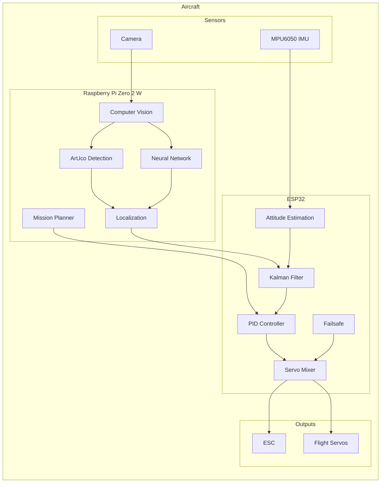
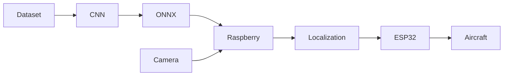
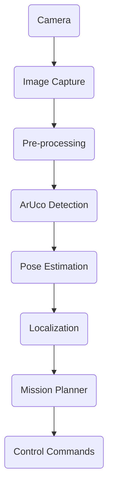

<div align="center">

# 🍋 Ardu-Citron

### *An autonomous fixed-wing aircraft built from scratch.*

*A personal robotics project exploring autonomous flight, embedded systems, computer vision and artificial intelligence.*

---


*Learning by rebuilding every brick of an autonomous aircraft.*

</div>

---

# Table of Contents

- [About](#about)
- [Why this project?](#why-this-project)
- [Project Philosophy](#project-philosophy)
- [Project Goals](#project-goals)
- [Current Features](#current-features)
- [Architecture Overview](#architecture-overview)
- [Hardware](#hardware)
- [Software Stack](#software-stack)

---

# About

**Ardu-Citron** is a personal project whose objective is to design an autonomous fixed-wing aircraft entirely from scratch.

Unlike mature autopilot projects such as **ArduPilot** or **PX4**, Ardu-Citron does **not** aim to replace existing flight controllers.

Instead, the project serves as a learning platform where every subsystem is designed, implemented and continuously improved to better understand how autonomous aircraft actually work.

The project combines several fields of robotics:

- Embedded systems
- Flight control
- Computer vision
- Sensor fusion
- Artificial intelligence
- Machine learning
- High-performance computing
- Autonomous navigation

The final objective is to build a fully autonomous aircraft capable of completing an entire mission without human intervention.

---

# Why this project?

There are already excellent open-source autopilots.

Projects like PX4 and ArduPilot are the result of years of development by hundreds of contributors.

Trying to compete with them would make little sense.

Ardu-Citron exists for another reason.

It is a long-term engineering challenge whose objective is to understand each building block of an autonomous aircraft by implementing it rather than simply using it.

Every new algorithm added to the project is another opportunity to learn.

Whether it is a Kalman filter, a PID controller, computer vision or neural network inference, the objective remains the same:

> **Understand before using.**

---

# Project Philosophy

The philosophy behind Ardu-Citron can be summarized in one sentence.

> *"How far can a single developer go while understanding every part of an autonomous aircraft?"*

Instead of depending entirely on existing software, Ardu-Citron gradually rebuilds many of the components commonly found inside modern autopilots.

This approach makes experimentation easier while providing a much deeper understanding of robotics and autonomous flight.

The project should therefore be seen as an engineering laboratory rather than a finished product.

Every subsystem is designed to answer a question.

Every experiment teaches something.

Every failure improves the next iteration.

---

# Why "Ardu-Citron"?

The name comes from a rather unexpected place.

During a physics class, a random conversation somehow ended with someone asking:

> *"Wouldn't an airplane shaped like a lemon be cool?"*

The joke survived much longer than expected.

Eventually it became the official name of the project.

The **Ardu** prefix is a reference to the famous **ArduPilot** project.

The **Citron** ("Lemon" in French) is simply a reminder that many serious engineering projects sometimes begin with completely ridiculous ideas.

---

# Project Goals

The long-term objective is to develop a fully autonomous fixed-wing aircraft capable of completing an entire flight mission.

Planned capabilities include:

- Autonomous takeoff
- Autonomous landing
- Autonomous waypoint navigation
- Indoor flight without GPS
- Computer vision localization
- Sensor fusion
- Obstacle avoidance
- Automatic mission execution
- Autonomous emergency handling

Although flight is the final objective, software architecture and reliability remain the project's primary focus.

---

# Current Features

## Flight Controller

- IMU acquisition
- Sensor calibration
- Attitude estimation
- PID stabilization
- Servo mixer
- ESC control
- Failsafe handling
- Buzzer notifications

---

## Computer Vision

- Camera acquisition
- ArUco marker detection
- Pose estimation
- Localization experiments
- OpenCV processing pipeline

---

## Sensor Fusion

- Kalman filtering
- Vision + IMU fusion
- State estimation

---

## Artificial Intelligence

Python tools currently provide:

- Dataset generation
- Dataset augmentation
- CNN training
- Performance benchmarking

The trained neural networks are intended to run onboard rather than inside Python itself.

---

## Performance

Performance-critical components are progressively rewritten in **Rust** in order to reduce latency while maintaining clean interfaces with the rest of the software.

---

# Current Status

> 🚧 **Active Development**

Ardu-Citron is currently under active development.

Some subsystems already operate independently, while others are still experimental.

The objective is continuous improvement rather than rapid feature completion.

---

# Architecture Overview



---

# Software Architecture

| Layer | Responsibilities |
|--------|------------------|
| Raspberry Pi Zero 2 W | Computer vision, localization, mission planning, neural network inference |
| ESP32 | Flight stabilization, sensor acquisition, actuator control |
| Rust Modules | High-performance algorithms |
| Python Tools | Dataset generation, CNN training, benchmarking |

---

# Hardware

| Component | Purpose |
|-----------|---------|
| ESP32 | Flight controller |
| Raspberry Pi Zero 2 W | High-level processing |
| MPU6050 | Inertial Measurement Unit |
| Camera | Visual localization |
| Brushless ESC | Motor control |
| Servos | Flight surfaces |

---

# Software Stack

| Language | Usage |
|-----------|-------|
| C++ | Embedded flight controller |
| Rust | Performance-critical modules |
| Python | Development tools and AI training |

---

---

# Repository Structure

The repository is organized into several independent modules, each responsible for a specific aspect of the project.

```text
Ardu-Citron
│
├── Code
│   ├── ESP_32
│   │   ├── Firmware
│   │   ├── Drivers
│   │   ├── Sensor Processing
│   │   ├── Flight Control
│   │   └── Utilities
│   │
│   ├── Pi
│   │   ├── Vision
│   │   ├── Localization
│   │   ├── Neural Networks
│   │   ├── Rust Modules
│   │   └── Benchmarks
│   │
│   ├── V1
│   │   First generation prototype
│   │
│   └── V2
│       Current generation
│
├── docs
│   Future documentation
│
└── README.md
```

---

# Repository Organization

| Directory | Description |
|------------|-------------|
| ESP_32 | Flight controller firmware |
| Pi | Computer vision, localization and AI |
| V1 | First experimental architecture |
| V2 | Current development version |
| docs | Documentation, diagrams and images |

---

# Software Architecture

The project is divided into two independent computers.

This separation allows each processor to focus on what it does best.

## ESP32

The ESP32 is responsible for **real-time tasks**.

These include:

- Reading sensors
- IMU processing
- Flight stabilization
- Servo control
- ESC control
- Failsafe management
- Safety monitoring

Typical execution frequency:

| Task | Frequency |
|------|-----------|
| IMU | 100 Hz |
| Kalman Filter | 100 Hz |
| PID Controller | 100 Hz |
| Servo Output | 100 Hz |

---

## Raspberry Pi Zero 2 W

The Raspberry Pi performs computationally intensive operations.

These include:

- Camera acquisition
- Computer vision
- ArUco detection
- Neural network inference
- Localization
- Mission planning
- High-level decision making

Typical execution frequency:

| Task | Frequency |
|------|-----------|
| Camera | 30 FPS |
| ArUco Detection | Variable |
| Localization | 10–20 Hz |
| Mission Planner | 5–10 Hz |

---

# Communication

Both computers exchange only high-level information.

```text
ESP32 ---------------- Raspberry Pi

Roll  <----------------

Pitch <----------------

Yaw   <----------------

Altitude <-------------

Localization ---------->

Status ---------------->

Failsafe -------------->
```

The ESP32 always remains capable of stabilizing the aircraft independently.

If the Raspberry Pi becomes unavailable, the aircraft should remain controllable.

---

# Flight Pipeline

The complete processing pipeline can be summarized as follows.

```text
Camera
   │
   ▼
Image Acquisition
   │
   ▼
OpenCV Processing
   │
   ▼
ArUco Detection
   │
   ▼
Pose Estimation
   │
   ▼
Sensor Fusion
   │
   ▼
Mission Planning
   │
   ▼
Flight Controller
   │
   ▼
Servo Commands
```

---

# Development Workflow

The project follows a modular workflow.



---

# Building the Project

## ESP32 Firmware

The ESP32 firmware can be compiled using the Arduino IDE.

Required libraries include:

- Wire
- MPU6050
- EEPROM
- Servo library (ESP32)

Upload the firmware to the ESP32 using the appropriate serial port.

---

## Raspberry Pi

Clone the repository.

```bash
git clone https://github.com/Sts-simon/Ardu-Citron.git

cd Ardu-Citron
```

---

Create a Python virtual environment.

```bash
python3 -m venv venv
```

Activate it.

Linux

```bash
source venv/bin/activate
```

Windows

```powershell
venv\Scripts\activate
```

Install dependencies.

```bash
pip install -r requirements.txt
```

---

## Rust Modules

Compile optimized Rust modules.

```bash
cargo build --release
```

---

# Dependencies

The project currently relies on several technologies.

| Software | Purpose |
|-----------|---------|
| OpenCV | Computer vision |
| ONNX Runtime | Neural network inference |
| NumPy | Numerical computing |
| Rust | High-performance modules |
| Cargo | Rust package manager |
| Arduino IDE | ESP32 firmware |
| Python 3 | Development tools |

---

# Machine Learning

Python is **not** part of the onboard autopilot.

Instead, Python is used offline for:

- Dataset generation
- Dataset augmentation
- CNN training
- Model evaluation
- Benchmarking

Once trained, models are exported and intended to run on the Raspberry Pi.

---

# Design Choices

Several design decisions were made early in the project.

### Why a fixed-wing aircraft?

Fixed-wing aircraft are more energy efficient than multirotors and better suited for long-duration autonomous flight.

---

### Why ESP32?

The ESP32 provides:

- sufficient processing power
- integrated Wi-Fi and Bluetooth
- low cost
- large community support
- real-time capabilities

---

### Why Raspberry Pi Zero 2 W?

The Raspberry Pi Zero 2 W offers a good balance between:

- size
- weight
- power consumption
- computing performance

making it well suited for onboard computer vision.

---

### Why Rust?

Some algorithms require deterministic performance.

Rust provides:

- native performance
- memory safety
- modern tooling
- zero-cost abstractions

making it an excellent choice for latency-sensitive components.

---

### Why not use ArduPilot?

Because the purpose of this project is not to replace existing autopilots.

The objective is to understand how they work by rebuilding many of their internal components.

---

# Development Status

Current priorities include:

- Improving localization accuracy
- Increasing software modularity
- Better sensor fusion
- Indoor autonomous navigation
- Automatic landing
- Hardware integration
- Flight testing

---

---

# System Overview

Ardu-Citron is designed around a distributed architecture.

Instead of relying on a single onboard computer, the project separates the workload between two processors.

The objective is to keep all real-time flight-critical tasks isolated from computationally intensive algorithms such as computer vision.

```text
                    +-------------------------+
                    | Raspberry Pi Zero 2 W   |
                    |-------------------------|
                    | Computer Vision         |
                    | Localization            |
                    | Mission Planning        |
                    | Neural Networks         |
                    +------------+------------+
                                 │
                                 │ High-level commands
                                 │
                                 ▼
                    +-------------------------+
                    | ESP32 Flight Controller |
                    |-------------------------|
                    | Sensor Acquisition      |
                    | Kalman Filter           |
                    | PID Controllers         |
                    | Mixer                   |
                    | Servo Output            |
                    | ESC Control             |
                    +------------+------------+
                                 │
                 +---------------+----------------+
                 │                                │
                 ▼                                ▼
            Flight Surfaces                  Brushless Motor
```

---

# Flight Control Loop

The flight controller executes continuously during flight.

Each iteration performs the following operations:

```text
Read Sensors
      │
      ▼
Sensor Calibration
      │
      ▼
Attitude Estimation
      │
      ▼
Kalman Filter
      │
      ▼
Flight Controller
      │
      ▼
Servo Mixer
      │
      ▼
ESC + Servos
      │
      ▼
Repeat
```

The objective is to keep the control loop deterministic and independent from vision processing.

---

# Computer Vision Pipeline

Visual processing is executed on the Raspberry Pi.

Each captured image goes through several processing stages before contributing to aircraft navigation.



The localization module estimates the aircraft position and orientation before sending navigation updates to the ESP32.

---

# Sensor Fusion

Neither the camera nor the IMU is sufficient on its own.

Each sensor has strengths and weaknesses.

| Sensor | Advantages | Limitations |
|---------|------------|-------------|
| IMU | Fast, high update rate | Drift over time |
| Camera | Absolute positioning | Lower update rate |
| ArUco | Accurate pose estimation | Requires visible markers |

The Kalman filter combines these measurements to produce a more reliable estimate of the aircraft state.

---

# Neural Networks

Machine learning is used as a research tool rather than the core of the flight controller.

Python is responsible for:

- Dataset generation
- Dataset augmentation
- Training
- Validation
- Performance evaluation

Once trained, models are exported to ONNX format before deployment.

```text
Simulation
      │
      ▼
Dataset Generation
      │
      ▼
Training
      │
      ▼
Validation
      │
      ▼
ONNX Export
      │
      ▼
Embedded Deployment
```

---

# Rust Modules

Some algorithms are implemented in Rust to improve performance while maintaining memory safety.

Typical candidates include:

- Pose estimation
- Filtering
- Localization
- Image processing
- Performance-critical mathematical operations

Rust modules are designed as independent components that can be benchmarked separately from the rest of the software.

---

# Safety

Safety remains a major design objective.

Several mechanisms are progressively integrated into the project.

Current or planned protections include:

- Sensor validation
- Failsafe handling
- Communication monitoring
- Lost camera detection
- Invalid localization rejection
- Watchdog timers
- Safe startup sequence

The aircraft should always remain controllable even if the Raspberry Pi becomes unavailable.

---

# Performance Objectives

Rather than targeting maximum speed, Ardu-Citron focuses on predictable execution times.

Current objectives include:

| Component | Target |
|-----------|-------:|
| Flight Controller | 100 Hz |
| IMU Processing | 100 Hz |
| Vision Processing | 20–30 FPS |
| Localization | 10–20 Hz |
| Mission Planning | 5–10 Hz |

Future optimizations will primarily focus on reducing latency instead of increasing raw throughput.

---

# Software Design

The software follows several engineering principles.

## Modularity

Each subsystem should remain independent whenever possible.

This allows individual components to be developed, tested and replaced without affecting the entire project.

---

## Separation of Responsibilities

Each processor has a clearly defined role.

ESP32:

- Real-time control
- Stabilization
- Safety
- Sensor acquisition

Raspberry Pi:

- Computer vision
- Localization
- Planning
- AI

---

## Scalability

The project is intentionally designed to support future hardware upgrades.

Examples include:

- Better cameras
- More powerful Raspberry Pi boards
- Alternative IMUs
- Different aircraft configurations

The objective is to keep software changes to a minimum when hardware evolves.

---

# Development Philosophy

Ardu-Citron is developed incrementally.

Every subsystem follows the same workflow:

```text
Research
    │
    ▼
Prototype
    │
    ▼
Testing
    │
    ▼
Validation
    │
    ▼
Integration
    │
    ▼
Optimization
```

This iterative approach makes debugging easier while ensuring that every component is understood before becoming part of the flight stack.

---

# Future Improvements

The project is continuously evolving.

Some long-term ideas include:

- Visual-Inertial Odometry (VIO)
- Better obstacle avoidance
- More advanced mission planning
- Improved indoor localization
- Faster neural network inference
- Automatic calibration
- Ground station software
- Hardware-in-the-loop simulation
- Continuous Integration (CI)
- Automated testing

---

> *"Building an autonomous aircraft is not about writing one big program.*
>
> *It is about building hundreds of small systems that all work together reliably."*

---


