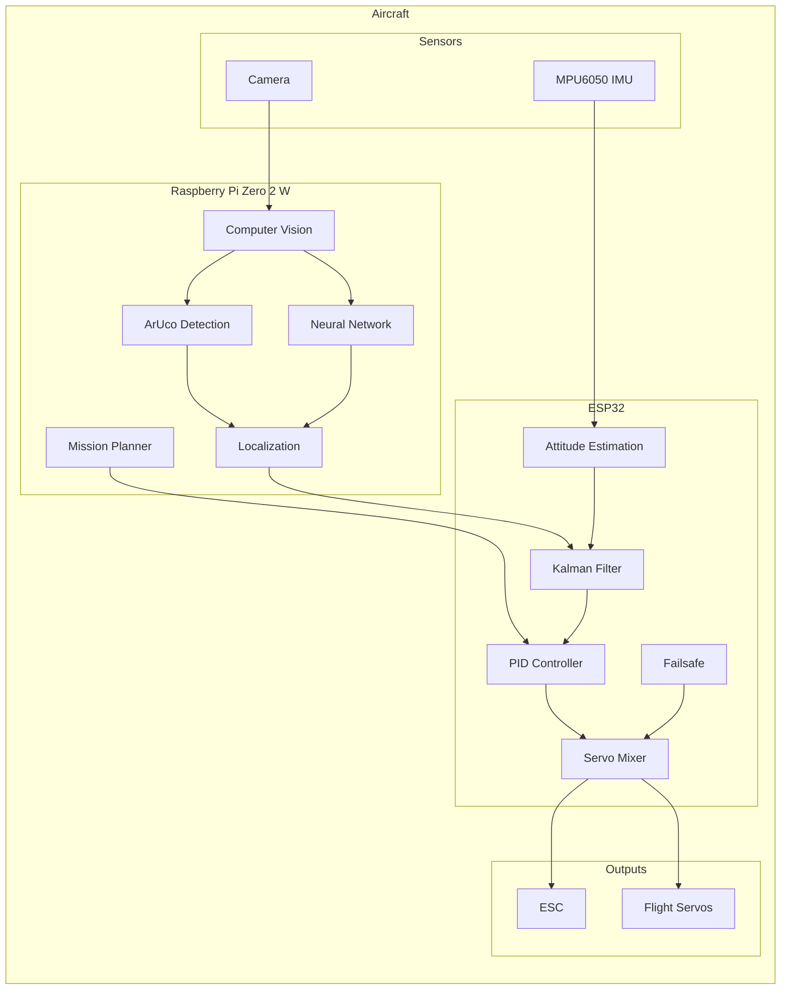
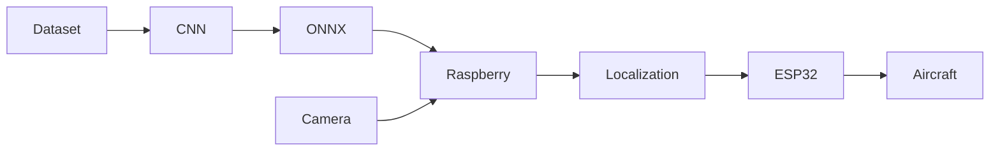
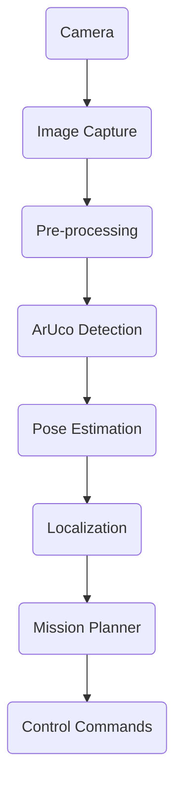

<div align="center">

# 🍋 Ardu-Citron

### *An autonomous fixed-wing aircraft built from scratch.*

*A personal robotics project exploring autonomous flight, embedded systems, computer vision and artificial intelligence.*

---


*Learning by rebuilding every brick of an autonomous aircraft.*

</div>

---

# Table of Contents

- [About](#about)
- [Why this project?](#why-this-project)
- [Project Philosophy](#project-philosophy)
- [Project Goals](#project-goals)
- [Current Features](#current-features)
- [Architecture Overview](#architecture-overview)
- [Hardware](#hardware)
- [Software Stack](#software-stack)
- [Repository Structure](#repository-structure)
- [Perception Pipeline: Simulation → CNN → ONNX](#perception-pipeline-simulation--cnn--onnx)
- [Rust Modules](#rust-modules)
- [Building the Project](#building-the-project)

---

# About

**Ardu-Citron** is a personal project whose objective is to design an autonomous fixed-wing aircraft entirely from scratch.

Unlike mature autopilot projects such as **ArduPilot** or **PX4**, Ardu-Citron does **not** aim to replace existing flight controllers.

Instead, the project serves as a learning platform where every subsystem is designed, implemented and continuously improved to better understand how autonomous aircraft actually work.

The project combines several fields of robotics:

- Embedded systems
- Flight control
- Computer vision
- Sensor fusion
- Artificial intelligence
- Machine learning
- High-performance computing
- Autonomous navigation

The final objective is to build a fully autonomous aircraft capable of completing an entire mission without human intervention.

---

# Why this project?

There are already excellent open-source autopilots.

Projects like PX4 and ArduPilot are the result of years of development by hundreds of contributors.

Trying to compete with them would make little sense.

Ardu-Citron exists for another reason.

It is a long-term engineering challenge whose objective is to understand each building block of an autonomous aircraft by implementing it rather than simply using it.

Every new algorithm added to the project is another opportunity to learn.

Whether it is a Kalman filter, a PID controller, computer vision or neural network inference, the objective remains the same:

> **Understand before using.**

---

# Project Philosophy

The philosophy behind Ardu-Citron can be summarized in one sentence.

> *"How far can a single developer go while understanding every part of an autonomous aircraft?"*

Instead of depending entirely on existing software, Ardu-Citron gradually rebuilds many of the components commonly found inside modern autopilots.

This approach makes experimentation easier while providing a much deeper understanding of robotics and autonomous flight.

The project should therefore be seen as an engineering laboratory rather than a finished product.

Every subsystem is designed to answer a question.

Every experiment teaches something.

Every failure improves the next iteration.

---

# Why "Ardu-Citron"?

The name comes from a rather unexpected place.

During a physics class, a random conversation somehow ended with someone asking:

> *"Wouldn't an airplane shaped like a lemon be cool?"*

The joke survived much longer than expected.

Eventually it became the official name of the project.

The **Ardu** prefix is a reference to the famous **ArduPilot** project.

The **Citron** ("Lemon" in French) is simply a reminder that many serious engineering projects sometimes begin with completely ridiculous ideas.

---

# Project Goals

The long-term objective is to develop a fully autonomous fixed-wing aircraft capable of completing an entire flight mission.

Planned capabilities include:

- Autonomous takeoff
- Autonomous landing
- Autonomous waypoint navigation
- Indoor flight without GPS
- Computer vision localization
- Sensor fusion
- Obstacle avoidance
- Automatic mission execution
- Autonomous emergency handling

Although flight is the final objective, software architecture and reliability remain the project's primary focus.

---

# Current Features

## Flight Controller (ESP32)

- MPU6050 IMU driver (direct register access, no external library)
- 2-state Kalman filter (angle/bias) per axis for attitude estimation
- Generic PID controller (anti-windup, filtered derivative, output clamping)
- Configurable Roll/Pitch/Yaw → servo mixer (`STANDARD_AIL_ELEV_RUD`, `VTAIL`, `ELEVON` presets)
- Non-blocking multi-frequency scheduler in `main.ino`
- Failsafe architecture (implemented, RC input not wired yet)
- Non-blocking buzzer feedback (calibration/status tones)
- All tuning centralized in a single `config.h` (setpoints, PID gains, pinout, frequencies)

---

## Computer Vision & Perception (Raspberry Pi)

- ArUco marker detection (`DICT_4X4_1000`) via OpenCV
- Pose estimation (`solvePnP`) with disambiguation against IMU pitch
- A lightweight CNN (`TinyDroneLocalizer`) trained to regress the drone's relative pose (X, Y, Z, Roll, Pitch, Yaw) directly from a cropped camera ROI
- Model export to ONNX for embedded inference

---

## Simulation & Synthetic Datasets

Since flight-testing a vision pipeline is slow and hard to instrument, the project includes a full **camera + flight-dynamics simulator** (`Ardu-Citron-3/Sol/CNN/generate_dataset.py`) that renders synthetic but physically-grounded training data — see [Perception Pipeline](#perception-pipeline-simulation--cnn--onnx) below.

---

## Sensor Fusion

- Kalman filtering (attitude, ESP32 side)
- A separate 3D Kalman filter (position: X, Y, Z) fusing CNN pose estimates over time, prototyped in Rust (`rust_localizer`)

---

## Performance

Performance-critical localization/filtering code is being progressively rewritten in **Rust** (`Code/Pi/rust_localizer`) to reduce latency while keeping a clean interface with the rest of the software.

---

## Mechanical Design

- 3D-printable airframe parts (`Model_3d/`): modular rail system (`Rail_Male.stl` / `Rail_Femelle.stl`), camera mount for the Raspberry Pi Camera Module v3
- Full airframe model in Blender (`Drone.blend.blend`)

---

# Current Status

> 🚧 **Active Development**

Ardu-Citron is currently under active development.

Some subsystems already operate independently, while others are still experimental.

The objective is continuous improvement rather than rapid feature completion.

---

# Architecture Overview



---

# Software Architecture

| Layer | Responsibilities |
|--------|------------------|
| Raspberry Pi Zero 2 W | Computer vision, localization, mission planning, neural network inference |
| ESP32 | Flight stabilization, sensor acquisition, actuator control |
| Rust Modules | High-performance algorithms |
| Python Tools | Dataset generation, CNN training, benchmarking |

---

# Hardware

| Component | Purpose |
|-----------|---------|
| ESP32 | Flight controller |
| Raspberry Pi Zero 2 W | High-level processing |
| MPU6050 | Inertial Measurement Unit |
| Raspberry Pi Camera Module v3 | Visual localization |
| Brushless ESC | Motor control |
| 3× Servos | Flight surfaces (ailerons/elevator/rudder, or V-tail/elevon presets) |
| 3D-printed airframe (`Model_3d/`) | Modular rail-based structure + camera mount |

---

# Software Stack

| Language | Usage |
|-----------|-------|
| C++ | Embedded flight controller |
| Rust | Performance-critical modules |
| Python | Development tools and AI training |

---

---

# Repository Structure

The repository currently contains a single active hardware generation (`Ardu-Citron-3`), organized by subsystem.

```text
Ardu-Citron
│
├── Ardu-Citron-3
│   │
│   ├── Code
│   │   ├── ESP_32
│   │   │   ├── main/                 Flight controller firmware (see its own README)
│   │   │   │   main.ino, config.h, imu.*, kalman.*, pid.*, mixer.*, failsafe.*, buzzer.*
│   │   │   ├── Actionneur_Check/     Standalone servo/ESC bench-test sketch
│   │   │   ├── Teste_Mpu/            Standalone MPU6050 bench-test sketch
│   │   │   └── pinout.txt            Physical pin mapping reference
│   │   │
│   │   └── Pi
│   │       ├── rust_localizer/       Rust position Kalman filter + IMU complementary filter
│   │       └── tiny_drone_cnn.pth    Trained CNN weights (copy for deployment)
│   │
│   ├── Model_3d/                     Airframe CAD: Blender project + 3D-printable STL parts
│   │
│   └── Sol/CNN/                      Simulator, dataset generation, CNN training & evaluation
│       generate_dataset.py, train_cnn.py, export_onnx.py, evaluate_cnn.py,
│       evaluate_onnx.py, run_rust_benchmark.py, aruco_detector.py, Prepare.py, ...
│
├── Docs/                             Design documents (specifications, speed estimation)
│
├── Commande.txt                      Personal notes / recurring shell commands
├── sauvegarde_git.sh                 Convenience script to auto-commit & push
└── README.md
```

---

# Repository Organization

| Path | Description |
|------|-------------|
| `Ardu-Citron-3/Code/ESP_32/main` | Flight controller firmware (IMU, Kalman, PID, mixer, failsafe) |
| `Ardu-Citron-3/Code/ESP_32/*_Check`, `Teste_Mpu` | Isolated hardware bring-up sketches |
| `Ardu-Citron-3/Code/Pi/rust_localizer` | Rust prototype: position Kalman filter + IMU fusion |
| `Ardu-Citron-3/Model_3d` | Blender model and STL files for the 3D-printed airframe |
| `Ardu-Citron-3/Sol/CNN` | Dataset simulator, CNN training, ONNX export, evaluation, Rust benchmark |
| `Docs` | Specifications and design notes (odt/ods) |

---

# Processor Responsibilities

The project is divided into two independent computers.

This separation allows each processor to focus on what it does best.

## ESP32

The ESP32 is responsible for **real-time tasks**.

These include:

- Reading sensors
- IMU processing
- Flight stabilization
- Servo control (ESC output pin reserved, throttle logic not implemented yet)
- Failsafe management
- Safety monitoring

Typical execution frequency:

| Task | Frequency |
|------|-----------|
| IMU | 100 Hz |
| Kalman Filter | 100 Hz |
| PID Controller | 100 Hz |
| Servo Output | 100 Hz |

---

## Raspberry Pi Zero 2 W

The Raspberry Pi performs computationally intensive operations.

These include:

- Camera acquisition
- Computer vision
- ArUco detection
- Neural network inference
- Localization
- Mission planning
- High-level decision making

Typical execution frequency:

| Task | Frequency |
|------|-----------|
| Camera | 30 FPS |
| ArUco Detection | Variable |
| Localization | 10–20 Hz |
| Mission Planner | 5–10 Hz |

---

# Communication

The two computers are designed to exchange only high-level information over a serial (UART) link.

```text
ESP32 ---------------- Raspberry Pi

Roll  <----------------

Pitch <----------------

Yaw   <----------------

Altitude <-------------

Localization ---------->

Status ---------------->

Failsafe -------------->
```

> **Status:** `config.h` already reserves the ESP32's hardware UART (`ENABLE_UART_BRIDGE`) for this purpose, but the physical link and the message protocol are not implemented yet. Today, the flight controller and the perception pipeline are developed and tested independently.

The ESP32 always remains capable of stabilizing the aircraft independently.

If the Raspberry Pi becomes unavailable, the aircraft should remain controllable.

---

# Flight Pipeline

The complete processing pipeline can be summarized as follows.

```text
Camera
   │
   ▼
Image Acquisition
   │
   ▼
OpenCV Processing
   │
   ▼
ArUco Detection
   │
   ▼
Pose Estimation
   │
   ▼
Sensor Fusion
   │
   ▼
Mission Planning
   │
   ▼
Flight Controller
   │
   ▼
Servo Commands
```

---

# Development Workflow

The project follows a modular workflow.



---

# Building the Project

## ESP32 Firmware

Open `Ardu-Citron-3/Code/ESP_32/main/main.ino` in the Arduino IDE.

The only external dependency is **ESP32Servo** (by Kevin Harrington), installable via *Tools > Manage Libraries…*. Everything else (`Wire`, I2C, the MPU6050 driver) is self-contained in the sketch or part of the Arduino-ESP32 core — see that folder's own `README.md` for tuning (`config.h`: setpoints, PID gains, mixer preset, pinout, frequencies).

Upload the firmware to the ESP32 using the appropriate serial port.

---

## Raspberry Pi / Simulation & CNN tools

Clone the repository.

```bash
git clone https://github.com/Sts-simon/Ardu-Citron.git
cd Ardu-Citron/Ardu-Citron-3/Sol/CNN
```

Create and activate a Python virtual environment, then install the packages used across the simulator/training/evaluation scripts:

```bash
python3 -m venv venv
source venv/bin/activate        # Windows: venv\Scripts\activate

pip install opencv-python numpy cairosvg pillow torch onnx onnxruntime
```

Generate the two datasets (see [Perception Pipeline](#perception-pipeline-simulation--cnn--onnx)):

```bash
python3 generate_dataset.py                    # both Dataset_Verification/ and Dataset_CNN/
python3 generate_dataset.py --skip-verification  # only Dataset_CNN (train/val)
python3 generate_dataset.py --skip-cnn           # only Dataset_Verification (trajectories)
```

Train, export and evaluate the CNN:

```bash
python3 train_cnn.py       # trains TinyDroneLocalizer, also exports an initial ONNX model
python3 export_onnx.py     # re-export a specific checkpoint to ONNX
python3 evaluate_cnn.py    # accuracy report (PyTorch)
python3 evaluate_onnx.py   # accuracy + CPU latency report (ONNX Runtime)
```

---

## Rust Modules

```bash
cd Ardu-Citron-3/Code/Pi/rust_localizer
cargo build --release
cargo run --release
```

---

# Dependencies

The project currently relies on several technologies.

| Software | Purpose |
|-----------|---------|
| OpenCV (`opencv-python`) | ArUco detection, pose estimation, image processing, dataset rendering |
| PyTorch | `TinyDroneLocalizer` CNN training |
| ONNX / ONNX Runtime | Model export and embedded/CPU inference |
| NumPy | Numerical computing (simulation, filtering) |
| cairosvg / Pillow | Rendering ArUco marker SVGs for the dataset simulator |
| Rust / Cargo | High-performance filtering modules (`rust_localizer`) |
| ESP32Servo (Arduino library) | Servo control on the flight controller |
| Arduino IDE | ESP32 firmware build/upload |
| Python 3 | Simulation, training, evaluation, benchmarking tools |

---

# Machine Learning

Python is **not** part of the onboard autopilot's real-time path. It is used offline for simulation, dataset generation, CNN training, ONNX export, and benchmarking — see [Perception Pipeline](#perception-pipeline-simulation--cnn--onnx) above for the full, concrete workflow.

Once trained, models are exported and intended to run on the Raspberry Pi.

---

# Design Choices

Several design decisions were made early in the project.

### Why a fixed-wing aircraft?

Fixed-wing aircraft are more energy efficient than multirotors and better suited for long-duration autonomous flight.

---

### Why ESP32?

The ESP32 provides:

- sufficient processing power
- integrated Wi-Fi and Bluetooth
- low cost
- large community support
- real-time capabilities

---

### Why Raspberry Pi Zero 2 W?

The Raspberry Pi Zero 2 W offers a good balance between:

- size
- weight
- power consumption
- computing performance

making it well suited for onboard computer vision.

---

### Why Rust?

Some algorithms require deterministic performance.

Rust provides:

- native performance
- memory safety
- modern tooling
- zero-cost abstractions

making it an excellent choice for latency-sensitive components.

---

### Why not use ArduPilot?

Because the purpose of this project is not to replace existing autopilots.

The objective is to understand how they work by rebuilding many of their internal components.

---

# Development Status

Current priorities include:

- Improving localization accuracy
- Increasing software modularity
- Better sensor fusion
- Indoor autonomous navigation
- Automatic landing
- Hardware integration
- Flight testing

---

---

# System Overview

Ardu-Citron is designed around a distributed architecture.

Instead of relying on a single onboard computer, the project separates the workload between two processors.

The objective is to keep all real-time flight-critical tasks isolated from computationally intensive algorithms such as computer vision.

```text
                    +-------------------------+
                    | Raspberry Pi Zero 2 W   |
                    |-------------------------|
                    | Computer Vision         |
                    | Localization            |
                    | Mission Planning        |
                    | Neural Networks         |
                    +------------+------------+
                                 │
                                 │ High-level commands
                                 │
                                 ▼
                    +-------------------------+
                    | ESP32 Flight Controller |
                    |-------------------------|
                    | Sensor Acquisition      |
                    | Kalman Filter           |
                    | PID Controllers         |
                    | Mixer                   |
                    | Servo Output            |
                    | ESC Control             |
                    +------------+------------+
                                 │
                 +---------------+----------------+
                 │                                │
                 ▼                                ▼
            Flight Surfaces                  Brushless Motor
```

---

# Flight Control Loop

The flight controller executes continuously during flight.

Each iteration performs the following operations:

```text
Read Sensors
      │
      ▼
Sensor Calibration
      │
      ▼
Attitude Estimation
      │
      ▼
Kalman Filter
      │
      ▼
Flight Controller
      │
      ▼
Servo Mixer
      │
      ▼
ESC + Servos
      │
      ▼
Repeat
```

The objective is to keep the control loop deterministic and independent from vision processing.

---

# Computer Vision Pipeline

Visual processing is executed on the Raspberry Pi.

Each captured image goes through several processing stages before contributing to aircraft navigation.



The localization module estimates the aircraft position and orientation before sending navigation updates to the ESP32.

---

# Sensor Fusion

Neither the camera nor the IMU is sufficient on its own.

Each sensor has strengths and weaknesses.

| Sensor | Advantages | Limitations |
|---------|------------|-------------|
| IMU | Fast, high update rate | Drift over time |
| Camera | Absolute positioning | Lower update rate |
| ArUco | Accurate pose estimation | Requires visible markers |

The Kalman filter combines these measurements to produce a more reliable estimate of the aircraft state.

---

# Perception Pipeline: Simulation → CNN → ONNX

Machine learning is used as a research tool to complement classical ArUco/PnP pose estimation, not to replace it. Everything lives in `Ardu-Citron-3/Sol/CNN/`.

```text
generate_dataset.py          (simulate camera + flight dynamics)
        │
        ├──> Dataset_Verification/   (continuous flight trajectories, for full-system testing)
        │
        └──> Dataset_CNN/train + val (independent, diverse examples, for training)
                    │
                    ▼
              train_cnn.py           (TinyDroneLocalizer CNN)
                    │
                    ▼
              export_onnx.py         (-> tiny_drone_localizer.onnx)
                    │
          ┌─────────┴─────────┐
          ▼                   ▼
  evaluate_cnn.py       evaluate_onnx.py
  (PyTorch accuracy)    (ONNX Runtime accuracy + CPU latency)
                    │
                    ▼
          run_rust_benchmark.py
  (classical ArUco/PnP + Rust Kalman fusion, benchmarked against the same ground truth)
```

## Two separate, non-overlapping datasets

A single flight simulator (`generate_dataset.py`) feeds two **intentionally separate** generators, so that training data can never leak into the data used to validate the whole system over time:

- **`Dataset_Verification/`** — continuous fixed-wing flight trajectories (turns, S-turns, climbs), with simulated MPU6050 IMU readings, realistic position drift/wind gusts, and a marker that enters the frame from one side and exits the other (the trajectory is cut short as soon as it leaves the frame for good). Used to validate the *whole* system over time (tracking, filtering, timing) — not to train the CNN.
- **`Dataset_CNN/train` and `Dataset_CNN/val`** — thousands of fully independent, randomly-sampled examples (altitude, attitude, marker position in frame, environment all drawn fresh each time, no flight continuity). Cropped directly to the CNN's ROI input size. Prioritizes distribution diversity over realism of any single flight.

## Simulated camera & environment realism

To reduce the sim-to-real gap, the simulator models, per frame or per trajectory:

- Full 3D perspective (homography) applied identically to the ground plane and the marker, so both share the same vanishing point under roll/pitch
- Heterogeneous ground textures, with a dedicated **gym floor** (court lines, key/paint areas, center circle, stenciled numbers) as the primary scenario, plus wood/tile/concrete/grass/dirt/asphalt
- Specular floor reflections, sun/neon lighting with ~100 Hz flicker and drifting white balance
- Full Brown-Conrady lens distortion (k1, k2, k3, p1, p2), rolling shutter, motion blur and mechanical vibration jitter
- Sensor-realistic noise (photon/shot noise, chrominance noise stronger in shadows, fixed hot pixels) and JPEG re-compression
- Imperfect physical markers (non-pure black/white print, paper grain, slight warping, lifted corners)

## Model & downstream tools

| Script | Role |
|--------|------|
| `generate_dataset.py` | Camera + flight-dynamics simulator; produces both datasets above |
| `train_cnn.py` | Trains `TinyDroneLocalizer`, a small CNN regressing (X, Y, Z, Roll, Pitch, sin/cos Yaw) from a 128×128 ROI |
| `export_onnx.py` | Exports trained PyTorch weights to ONNX for embedded inference |
| `evaluate_cnn.py` / `evaluate_onnx.py` | Accuracy + latency benchmarks (PyTorch vs. ONNX Runtime) against ground truth |
| `aruco_detector.py` | Thin OpenCV `DICT_4X4_1000` detector wrapper shared across scripts |
| `run_rust_benchmark.py` | End-to-end benchmark of the classical ArUco → PnP → Rust Kalman fusion pipeline |

Once trained and exported, the model is intended to run on the Raspberry Pi through ONNX Runtime (or the Rust `ort` bindings), not inside Python.

---

# Rust Modules

Some algorithms are implemented in Rust to improve performance while maintaining memory safety.

The current module, `Ardu-Citron-3/Code/Pi/rust_localizer`, prototypes:

- A 3-axis position Kalman filter (predict/update on X, Y, Z) fed by CNN pose estimates
- A complementary filter fusing MPU6050 gyro + accelerometer data for attitude

It depends on the [`ort`](https://crates.io/crates/ort) crate (ONNX Runtime bindings) for future direct CNN inference from Rust, and is currently exercised with simulated sensor/CNN signals (`main.rs`) to validate the filtering logic in isolation before wiring it to the real camera pipeline.

Rust modules are designed as independent components that can be benchmarked separately from the rest of the software — see `run_rust_benchmark.py`, which replays the generated dataset through classical ArUco/PnP detection and this Kalman fusion logic.

---

# Safety

Safety remains a major design objective.

Several mechanisms are progressively integrated into the project.

Current or planned protections include:

- Sensor validation
- Failsafe handling
- Communication monitoring
- Lost camera detection
- Invalid localization rejection
- Watchdog timers
- Safe startup sequence

The aircraft should always remain controllable even if the Raspberry Pi becomes unavailable.

---

# Performance Objectives

Rather than targeting maximum speed, Ardu-Citron focuses on predictable execution times.

Current objectives include:

| Component | Target |
|-----------|-------:|
| Flight Controller | 100 Hz |
| IMU Processing | 100 Hz |
| Vision Processing | 20–30 FPS |
| Localization | 10–20 Hz |
| Mission Planning | 5–10 Hz |

Future optimizations will primarily focus on reducing latency instead of increasing raw throughput.

---

# Software Design

The software follows several engineering principles.

## Modularity

Each subsystem should remain independent whenever possible.

This allows individual components to be developed, tested and replaced without affecting the entire project.

---

## Separation of Responsibilities

Each processor has a clearly defined role.

ESP32:

- Real-time control
- Stabilization
- Safety
- Sensor acquisition

Raspberry Pi:

- Computer vision
- Localization
- Planning
- AI

---

## Scalability

The project is intentionally designed to support future hardware upgrades.

Examples include:

- Better cameras
- More powerful Raspberry Pi boards
- Alternative IMUs
- Different aircraft configurations

The objective is to keep software changes to a minimum when hardware evolves.

---

# Development Philosophy

Ardu-Citron is developed incrementally.

Every subsystem follows the same workflow:

```text
Research
    │
    ▼
Prototype
    │
    ▼
Testing
    │
    ▼
Validation
    │
    ▼
Integration
    │
    ▼
Optimization
```

This iterative approach makes debugging easier while ensuring that every component is understood before becoming part of the flight stack.

---

# Future Improvements

The project is continuously evolving.

Some long-term ideas include:

- Visual-Inertial Odometry (VIO)
- Better obstacle avoidance
- More advanced mission planning
- Improved indoor localization
- Faster neural network inference
- Automatic calibration
- Ground station software
- Hardware-in-the-loop simulation
- Continuous Integration (CI)
- Automated testing

---

> *"Building an autonomous aircraft is not about writing one big program.*
>
> *It is about building hundreds of small systems that all work together reliably."*

---
